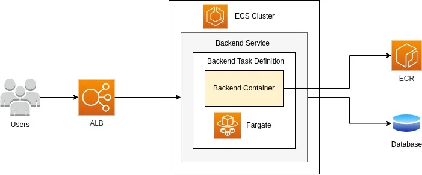
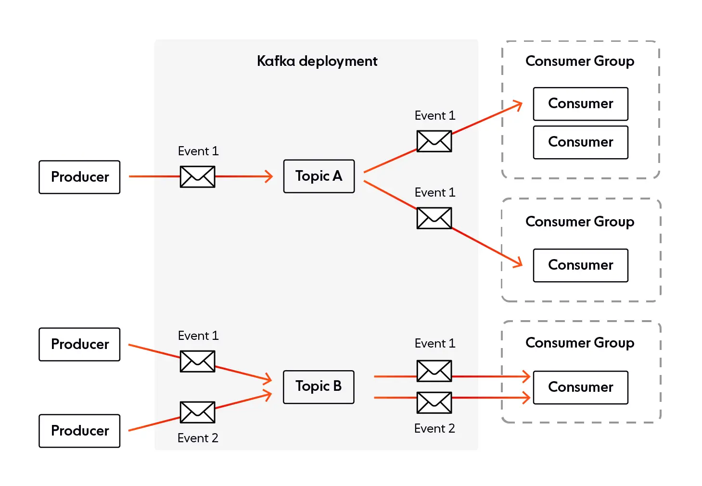
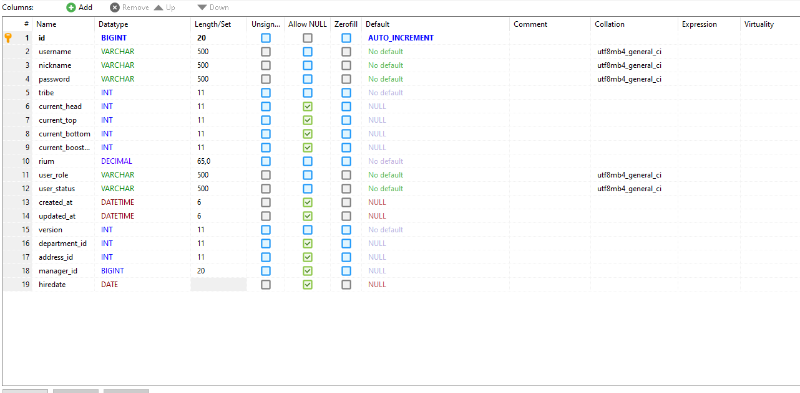

= ktor websocket sample

== swagger ui
http://127.0.0.1:8080

... if you running it on your local server

http://localhost:8080

== How to tune

. change parameters in `src/main/resources`
. set aws environmental variables and github actions secrets in `.github/workflows/aws.yml`

== Architecture

=== Cloud Architecture of AWS ECS with ALB

=== Producers and consumers writing and reading events from Kafka topics ( /messages/{group} )

/chat consists of connections only within one server.

=== Ci/cd pipeline
image::aws_architecture.jpg[]

== Database's table columns

== Example

utube video

. run `docker-compose up -d`
. run `RunningAverage`
. produce some data with `ConsoleProducer`

[source,bash]
.Consume from result topic
----
docker exec -it broker /usr/bin/kafka-console-consumer --topic rating-averages --bootstrap-server broker:9092 --property "print.key=true"\
 --property "key.deserializer=org.apache.kafka.common.serialization.LongDeserializer" --property "value.deserializer=org.apache.kafka.common.serialization.DoubleDeserializer" --from-beginning
----

