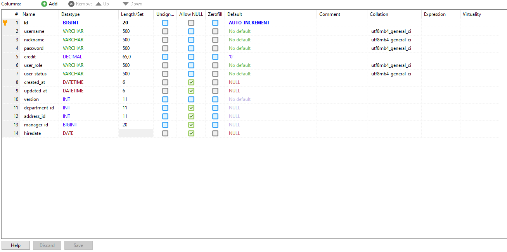

= Ktor web & websocket sample

== Tutorial movie

image::.adoc/images/tutorial1.PNG[link="https://youtu.be/6pRl7A75_-4",window=_blank]]

▲ Click the link!

// video::6pRl7A75_-4[youtube]

== Testing video

image::.adoc/images/test1.PNG[link="https://youtu.be/izDngUzWbrI",window=_blank]]

▲ Click the link!

// video::izDngUzWbrI[youtube]

== Swagger ui (Check out available APIs here!)

http://127.0.0.1:8080

 http://127.0.0.1:8080

... If running on a local server

http://localhost:8080

 http://localhost:8080

== Websocket url

 ws://127.0.0.1:8080/chat

... If running on a local server

 ws://localhost:8080/chat

.. Note) /chat consists of connections only within one server without kafka.

==

 ws://127.0.0.1:8080/messages/{group}

... If running on a local server

... ws://localhost:8080/messages/{group}

.. e.g)

 ws://127.0.0.1:8080/socket?food_topic

 ws://127.0.0.1:8080/socket?room1

. Note) Swagger does not support WebSockets

== Server operating environment

1 vCPU, 2 GB per instance on AWS

image::.adoc/images/task definition.PNG[]

== Kafka topic console

http://127.0.0.1:9080

 http://127.0.0.1:9080

... If running on a local server

http://localhost:9080

 http://localhost:9080

== How to tune

. Change parameters in `src/main/resources` and `plugin/src/test/resources/kafka-config-map.conf`
.. You don't have to create a matching Database. Just connect to your db and fill `src/main/resources/application.conf` > `ktor.deployment.db`
. Set aws environmental variables and github actions secrets in `.github/workflows/aws.yml`
. Run kafka server infrastructure using `docker compose up`

[source,bash]
.docker compose up command
----
docker compose up -d
----

== Architecture

=== Cloud Architecture of AWS ECS with ALB

=== Producers and consumers writing and reading events from Kafka topics ( /messages/{group} )

image::.adoc/images/kafka-producers-consumers-topics.jpg[]

=== Ci/cd pipeline

image::.adoc/images/aws_architecture.jpg[]

== User table columns

== How to use

. Post a user
. Login via /login path to acquire `Authorization` key
. Set `Authorization` key to `Authorization` header
... Don't forget the prefix `Bearer `
... e.g) `Bearer eyJhbGciOiJIU....`
. Now you can access every apis and websocket!
.. websocket url e.g) ws://localhost:8080/chat

[source,bash]
.websocket commands
----
connections // Shows the number of connections (/chat path)
bye // command for disconnect
did you still alive? // It is not a server command, but written in the mock client test code in `src/test/kotlin/com/aftertime/ApplicationTest.kt`.
----

=== Notice

... You don't need to create a user when connecting to `/messages/{group}`.
... If you connected with `Authorization` header, the server shows your nickname.

.../admins/... paths can only be accessed by admins(set your role to `ADMIN`.)

